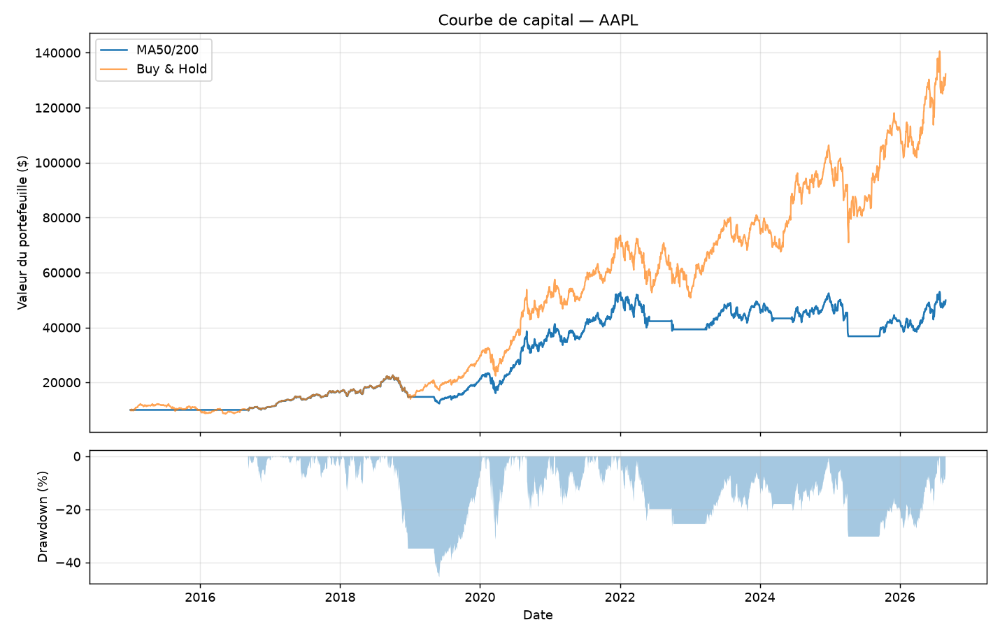

# Backtesteur de stratégies de moyennes mobiles

Un backtesteur minimal en Python qui évalue une stratégie de croisement de
moyennes mobiles sur des données boursières quotidiennes, et la compare
systématiquement à une stratégie « acheter et conserver ».




## Installation

```bash
git clone https://github.com/IlyasAlly/backtester.git
cd backtester
python3 -m venv .venv && source .venv/bin/activate   # Windows : .venv\Scripts\activate
pip install -r requirements.txt
```

## Utilisation

```bash
python main.py --ticker AAPL --fast 50 --slow 200 --start 2015-01-01
```

Résultat :
 
```
2931 séances chargées pour AAPL (2015-01-02 → 2026-08-28)

                         MA50/200  Buy & Hold
Rendement total (%)        398.86     1222.62
Rendement annualisé (%)     14.82       24.86
Volatilité (%)              23.68       28.75
Drawdown max (%)           -45.61      -38.52
Ratio de Sharpe              0.53        0.78
Transactions                 6.00        1.00
Temps investi (%)           70.20      100.00

Graphique écrit dans equity_curve.png
```

| Option | Défaut | Description |
|---|---|---|
| `--ticker` | `AAPL` | Symbole boursier (Yahoo Finance) |
| `--start` / `--end` | `2015-01-01` / aujourd'hui | Période analysée |
| `--fast` / `--slow` | `50` / `200` | Fenêtres des moyennes mobiles |
| `--capital` | `10000` | Capital initial |
| `--refresh` | — | Ignorer le cache et retélécharger |

## Résultats

Les résultats montrent que la stratégie MA50/200 fait moins bien que le buy-and-hold sur les deux titres testés. Sur AAPL, la stratégie obtient un rendement total de 398,86 %, contre 1222,62 % pour le buy-and-hold. Sur SPY, on retrouve le même résultat : 170,71 % pour la MA50/200 contre 352,04 % pour le buy-and-hold.

Un résultat assez inattendu apparaît sur SPY au niveau du drawdown. Les deux approches ont exactement le même drawdown maximal, soit -33,72 %, alors que la stratégie MA50/200 n'est investie que 76 % du temps. Dans cet épisode précis, sortir du marché n'a donc apporté aucune protection contre la baisse maximale.

Cela s'explique surtout par le krach de mars 2020. Une moyenne mobile de 200 jours réagit avec plusieurs semaines de retard, donc lorsque le marché baisse très rapidement, le signal de vente arrive trop tard. La stratégie vend après une partie importante de la baisse, puis rachète après le rebond, ce qui lui fait manquer une partie de la remontée. On retrouve aussi un phénomène similaire en 2022-2023, avec des périodes où la courbe de la stratégie reste assez plate pendant que le buy-and-hold remonte.

Au final, ces résultats montrent que les moyennes mobiles peuvent être intéressantes lorsque le marché alterne clairement entre des périodes de hausse et de baisse. Sur la période étudiée, qui a surtout été marquée par une longue tendance haussière, le buy-and-hold était donc dans une situation plus favorable que la stratégie MA50/200.

## Structure

```
backtester/
├── main.py              # interface en ligne de commande
├── src/
│   ├── data.py          # téléchargement, cache disque, validation
│   ├── strategy.py      # génération des signaux (0 = hors marché, 1 = investi)
│   ├── engine.py        # boucle de backtest, positions, journal des transactions
│   ├── metrics.py       # rendement, drawdown, Sharpe
│   └── plotting.py      # courbe de capital et drawdown
├── tests/               # pytest
└── data/cache/          # données téléchargées (non versionnées)
```

## Conception

**Séparation des responsabilités.** Une stratégie ne connaît que les prix et
ne produit que des signaux. Elle ignore tout des positions, du capital et des
transactions — c'est le moteur qui traduit un signal en position détenue.
Ajouter une nouvelle stratégie ne demande donc qu'une classe avec une méthode
`generate_signals`.

**Exécution décalée d'une barre.** Un signal calculé à partir de la clôture du
jour J est exécuté le jour J+1. Sans ce décalage, le backtest suppose qu'on
pouvait acheter à un prix qui n'était pas encore connu au moment de la
décision. C'est l'erreur la plus courante des backtests amateurs, et elle
produit des résultats spectaculaires et faux. Le test
`tests/test_engine.py::test_pas_de_lookahead` vérifie explicitement ce point.

**Prix ajustés.** Les données sont téléchargées avec `auto_adjust=True`, ce qui
corrige les fractionnements et les dividendes. Sans cet ajustement, un
fractionnement 4-pour-1 apparaît comme une chute de 75 % et déclenche un faux
signal de vente.

**Gestion des séances incomplètes.** J'ai choisi de supprimer les séances incomplètes plutôt que de compléter les valeurs manquantes avec `ffill`. Avec `ffill`, on pourrait créer des journées avec un rendement de 0 % qui n'ont jamais réellement existé. Cela réduirait artificiellement la volatilité et pourrait donc augmenter le ratio de Sharpe. Je préfère avoir une série un peu plus courte plutôt que d'inventer des données. Pour le volume, les valeurs manquantes sont mises à zéro, car propager un ancien volume reviendrait à inventer des transactions.

**Taux sans risque.** J'ai choisi un taux sans risque de **4 %** par défaut pour calculer le ratio de Sharpe. C'est une approximation, car le taux réel a beaucoup changé sur la période étudiée : il était proche de 0 % en 2020 et a ensuite dépassé 5 %. Utiliser un taux constant pendant toute la période peut donc légèrement fausser le Sharpe, mais j'ai choisi cette méthode pour garder le calcul simple.

**Comptage des années.** Pour calculer le rendement annualisé, je divise le nombre de lignes de données par **252**, qui correspond au nombre moyen de séances de bourse dans une année. Une autre possibilité aurait été d'utiliser directement les dates de l'index pour calculer la durée exacte. Les deux méthodes sont valables, mais elles ne donnent pas exactement le même résultat, notamment parce que les `dropna` peuvent avoir supprimé certaines séances. J'ai choisi la méthode des 252 séances car elle est plus simple.

**Volatilité nulle.** Lorsque la volatilité est égale à zéro, la fonction du ratio de Sharpe retourne **0.0** au lieu de faire une division par zéro. Cela permet notamment de gérer le cas où la stratégie n'a jamais été investie et où tous les rendements sont nuls.


## Tests

```bash
pytest -v
```

## Limites

Ce backtesteur est un outil d'apprentissage. Les résultats qu'il produit ne
constituent ni une recommandation d'investissement ni une estimation réaliste
de rendement, pour les raisons suivantes :

- **Aucun frais de transaction ni slippage.** Chaque transaction est supposée
  s'exécuter au prix affiché, sans commission ni écart entre le prix visé et
  le prix obtenu. Sur une stratégie qui négocie souvent, cette hypothèse suffit
  à transformer une perte en gain apparent.
- **Pas de biais du survivant pris en compte.** Tester une stratégie sur un
  titre qui existe encore aujourd'hui, c'est la tester sur un gagnant connu
  d'avance.
- **Un seul titre à la fois.** Ni portefeuille, ni gestion du risque, ni
  dimensionnement des positions.
- **Positions longues uniquement**, sans effet de levier ni vente à découvert.
- **Paramètres choisis, non validés.** Les fenêtres 50/200 sont conventionnelles.
  Les optimiser sur les mêmes données que celles du test reviendrait à
  surajuster ; une validation honnête demanderait une séparation
  entraînement / test hors échantillon.
- **Données quotidiennes.** Aucune information sur ce qui se passe à
  l'intérieur d'une séance.

## Pistes d'amélioration

- Modéliser les frais et le slippage en points de base par transaction
- Séparation hors échantillon pour le choix des paramètres
- Portefeuille multi-titres avec rééquilibrage
- Stratégies supplémentaires (RSI, retour à la moyenne, momentum)

## Licence

MIT
